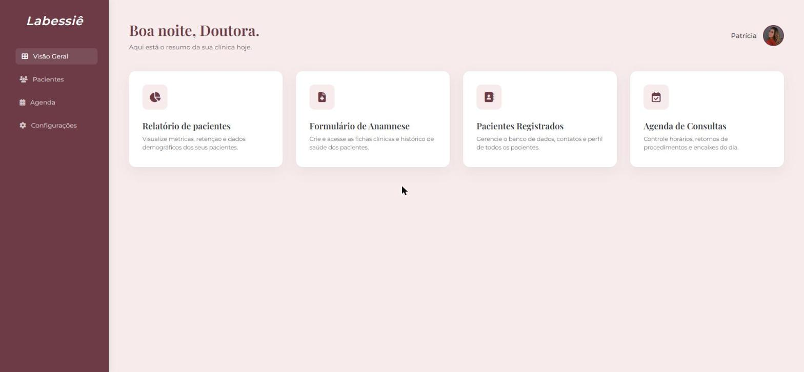

# Sistema para Clínica de Estética



Painel administrativo para uma clínica de estética, com visão geral do dia, agenda de atendimentos e cadastro de pacientes.

🔗 **Demo:** [paty-clinica.vercel.app](https://paty-clinica.vercel.app/pages/dashboard.html)

## Funcionalidades

- **Dashboard:** resumo diário dos atendimentos
- **Agenda:** marcação e acompanhamento de atendimentos
- **Pacientes:** cadastro e consulta de pacientes
- **Configurações:** dados da clínica e preferências
- Persistência centralizada em um módulo `store.js` (LocalStorage), compartilhado por todas as páginas
- Layout responsivo

## Tecnologias

HTML5, CSS3, JavaScript modular (ES6+), LocalStorage, deploy na Vercel.

## Como rodar

Não precisa de instalação. Abra `index.html` no navegador ou sirva a pasta com:

```bash
npx serve .
```

## Estrutura

```
index.html
pages/        # dashboard, agenda, pacientes, configurações
JavaScript/   # lógica de cada página + store.js (camada de dados)
Estilos/      # CSS de cada página
```

## Autor

Lucas Veiga Pinheiro — [LinkedIn](https://www.linkedin.com/in/lucas-veiga-pinheiro-5001653b0/) · [Portfólio](https://morphcodesite.vercel.app)
